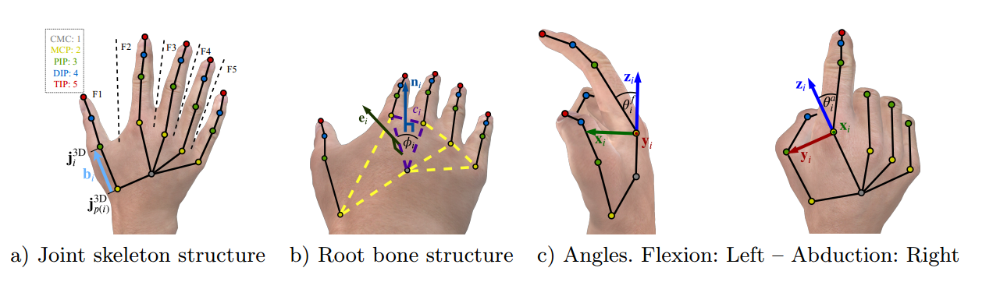
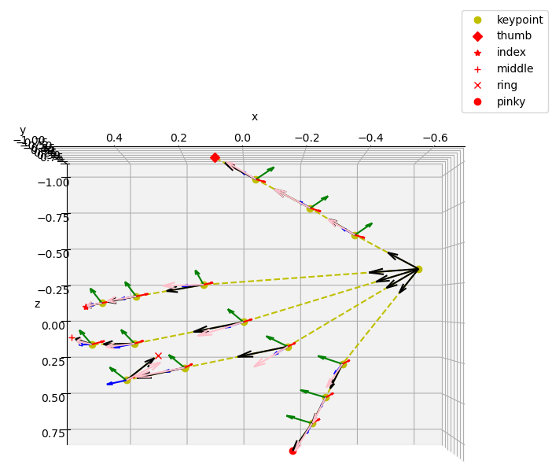
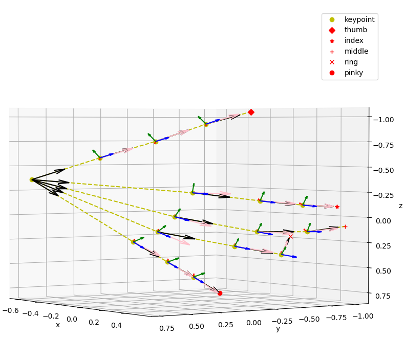
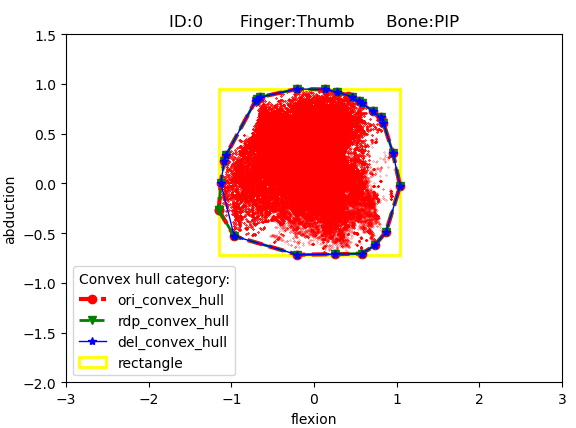
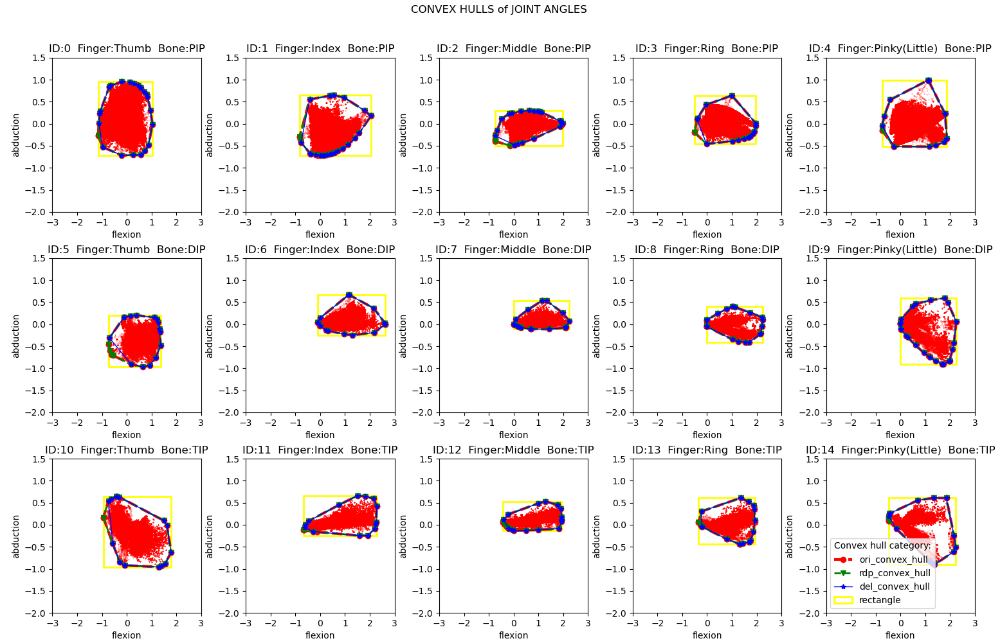
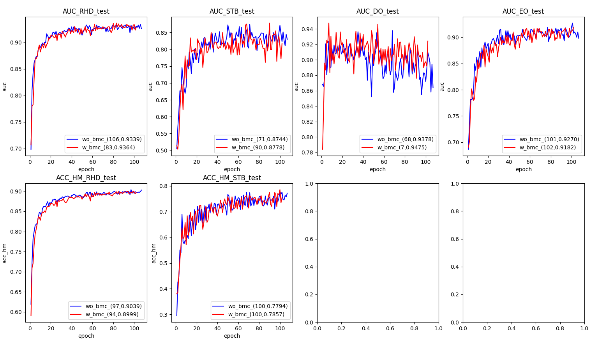

# Hand Biomechanical Constraints Pytorch

**Unofficial** PyTorch reimplementation of [Hand-Biomechanical-Constraints](https://www.ecva.net/papers/eccv_2020/papers_ECCV/papers/123620205.pdf) (ECCV2020). 


This project reimplement following components :
1. 3 kinds of biomechanical soft constraints
1. integrate BMC into training procedure  (PyTorch version)


## Usage

- Retrieve the code
```sh
git clone https://github.com/MengHao666/Hand-BMC-pytorch
cd Hand-BMC-pytorch
```

- Create and activate the virtual environment with python dependencies
```
conda env create --file=environment.yml
conda activate bmc
```


## Download data
Download 3D joint location data `joints.zip` [Google Drive](https://drive.google.com/file/d/1_wV8QjmsVCMBEBhm56gFA2XTyU8VEHzk/view?usp=sharing) or 
  [Baidu Pan](https://pan.baidu.com/s/1klLI8H7EojRdQFgoyQNhJg) (`2pip`), and . These statistics are from following datasets:
  
* [Rendered Handpose Dataset](https://lmb.informatik.uni-freiburg.de/resources/datasets/RenderedHandposeDataset.en.html)
* [GANerated Hands Dataset](https://handtracker.mpi-inf.mpg.de/projects/GANeratedHands/GANeratedDataset.htm)
* [STB Dataset](https://github.com/zhjwustc/icip17_stereo_hand_pose_dataset)  
* [Freihand Dataset](https://lmb.informatik.uni-freiburg.de/resources/datasets/FreihandDataset.en.html)  

**Note the data from these datasets under their own licenses.**

## Calculate BMC


### Run the  code
```
python calculate_bmc.py
```

You will get 
- `bone_len_max.npy` `bone_len_min.npy` for bone length limits
- `curvatures_max.npy` `curvatures_min.npy` for Root bones' curvatures 
- `PHI_max.npy` `PHI_min.npy` for Root bones' angular distance 
- `joint_angles.npy` for Joint angles 

And if u want to check the coordinate system, run the  code
```
cd utils
python calculate_joint_angles.py
```
- red ,green, blue arrows refer to X,Y,Z of local coordinate system respectively;
- dark arrows refer to bones;
- pink arrows refer to bone projection into X-Z plane of local coordinate system;

One view             |  Another view
:-------------------------:|:-------------------------:
  |  


### Run the  code
```
python calculate_convex_hull.py
```
You will get `CONVEX_HULLS.npy`, i.e. convex hulls to encircle the anatomically plausible joint angles.

And you will also see every convex hull like following figure:



- **"Bone PIP"** means the bone from MCP joint to PIP joint in thumb
- **flexion** and **abduction** is two kinds of angle describing joint rotation
- **"ori_convex_hull"** means the original convex hull calculated from all joint angle points
- **"rdp_convex_hull"** means convex hull simplified by the Ramer-Douglas-Peucker algorithm, a polygon simplification algorithm
- **"del_convex_hull"** means convex hull further simplified by a greedy algorithm
- **"rectangle"** means the minimal rectangle to surround all joint angle points

### Run the  code
```
python plot.py
```
You will see all the convex hulls



## Integrate BMC into training (PyTorch version)

Run the  code
```
python weakloss.py
```

## Experiment results 
To check influence of BMC, instead of reimplementing the network of origin paper, I integrate BMC into my own [project](https://github.com/MengHao666/Minimal-Hand-pytorch),
  

### Train and evaluation curve
(AUC means 3D PCK, and ACC_HM means 2D PCK)


### 3D PCK AUC Diffenence

|  Dataset  |        DetNet     | DetNet+BMC | 
|  :-----:  |    :------------: |  :-----:   | 
|  **RHD**  |        0.9339     |   0.9364    |       
|  **STB**  |        0.8744     |   0.8778    |       
|  **DO**   |        0.9378     |   0.9475    |         
|  **EO**   |        0.9270     |   0.9182    |        


### Note
- Adjusting training parameters carefully, longer training time might further boost accuracy.
- **As BMC is a weakly supervised method, it may only make predictions more physically plausible,but cannot boost AUC performance strongly when strong supervision is used.**

## Limitation
- Due to time limitation, I didn't reimplement the network and experiments of original paper.
- There is a little difference between original paper and my reimplementation. But most of them match.
## Citation

This is the **unofficial** pytorch reimplementation of the paper "Weakly supervised 3d hand pose estimation via biomechanical constraints (ECCV 2020).


If you find the project helpful, please star this project and cite them:
```
@article{spurr2020weakly,
  title={Weakly supervised 3d hand pose estimation via biomechanical constraints},
  author={Spurr, Adrian and Iqbal, Umar and Molchanov, Pavlo and Hilliges, Otmar and Kautz, Jan},
  journal={arXiv preprint arXiv:2003.09282},
  volume={8},
  year={2020},
  publisher={Springer}
}
```


